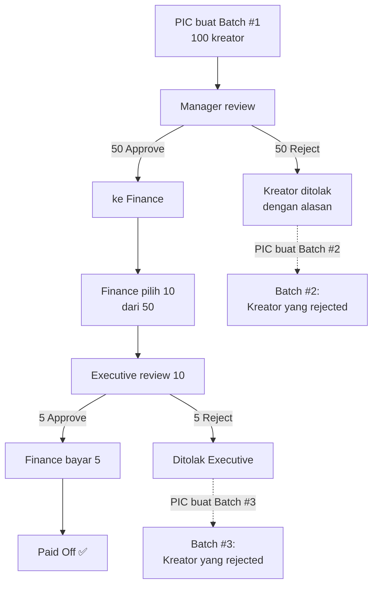

# Perombakan Sistem Pembayaran Kreator v2

Merombak total menu **Keuangan** di tiap campaign dan menu **Budgeting & Topup** menjadi sistem pembayaran kreator lengkap dengan **4 tahap approval** dan status tracking detail.

---

## Konteks Sistem yang Sudah Ada

### Database Tables Terkait (Sudah Ada)
| Tabel | Fungsi Saat Ini |
|---|---|
| `profiles` | User system. Role: `manager` / `anggota`. Status: `pending` / `approved` / `inactive` |
| `whitelisted_emails` | Whitelist email + role untuk auto-approve saat register |
| `user_campaigns` | Assignment anggota ke campaign tertentu |
| `campaigns` | Ada kolom `budget_creator_plafon` dan `budget_ads_plafon` |
| `campaign_creators` | Ada kolom `price`, `status_bayar`, `nominal_pelunasan`, `tgl_pembayaran` (pembayaran lama) |
| `creators` | Ada kolom `rekening`, `rekening_bank`, `rekening_atas_nama`, `rekening_nomor` (hanya 1 set) |
| `ads_spends` | Pengeluaran ads per campaign |
| `payout_requests` + `payout_creator` | Sistem invoice/payout lama (akan digantikan) |

### Halaman UI Terkait (Sudah Ada)
| Halaman | Fungsi Saat Ini |
|---|---|
| `/campaigns/[id]/keuangan` | 2 tab: Budget Creator (inline edit per kreator) + Budget Ads |
| `/budgeting` | Pilih campaign → lihat budget creator + link ke ads budgeting |
| `/invoice` | Payout requests approval (sistem lama) |
| `/manajemen-akun` | Kelola user (approve/reject/whitelist/assign campaign). Hanya role `manager` |

### Auth & Permission (Sudah Ada)
- Login via **Google OAuth** → cek whitelist → auto-approve atau pending
- `AuthProvider.tsx`: Menyediakan `profile`, `canEditCampaign(id)`
- Manager: akses semua. Anggota: akses campaign yang di-assign via `user_campaigns`
- Middleware (`proxy.ts`): Redirect ke `/login` jika belum login, ke `/pending` jika belum approved

---

## Proposed Changes

### Phase 1: Database Schema

---

#### [MODIFY] Tabel `profiles` — Tambah Role Baru

Saat ini role hanya `manager` dan `anggota`. Perlu ditambah `finance` dan `executive`.

```sql
-- Hapus constraint lama
ALTER TABLE profiles DROP CONSTRAINT IF EXISTS profiles_role_check;

-- Tambah constraint baru dengan 4 role
-- Hierarchy (tertinggi ke terendah): executive → finance → manager → anggota
ALTER TABLE profiles ADD CONSTRAINT profiles_role_check 
  CHECK (role IN ('executive', 'finance', 'manager', 'anggota'));
```

**Dampak ke kode existing:**
- `AuthProvider.tsx` → `canEditCampaign()`: Manager return `true`. Finance & Executive juga harus return `true` (akses semua campaign).
- `ManajemenAkunClient.tsx` → Whitelist form: Dropdown role perlu ditambah opsi `finance` dan `executive`.
- `proxy.ts` (middleware): Tidak perlu diubah (hanya cek `status`, bukan `role`).
- Sidebar layout: Menu "Manager Tools" perlu dibuka juga untuk `finance` dan `executive`. Tambah menu baru khusus Finance/Executive.

---

#### [NEW] Tabel `creator_bank_accounts` — Rekening Kreator (Multiple)

Saat ini tabel `creators` hanya simpan 1 rekening. Kita perlu tabel terpisah agar **1 kreator bisa punya banyak rekening**. PIC bisa pilih dari dropdown, atau ketik manual (otomatis tersimpan).

```sql
CREATE TABLE creator_bank_accounts (
  id SERIAL PRIMARY KEY,
  creator_id INT NOT NULL REFERENCES creators(id) ON DELETE CASCADE,
  bank_name TEXT NOT NULL,           -- BCA, DANA, ShopeePay, BRI, dll
  account_number TEXT NOT NULL,      -- Nomor rekening/VA
  account_holder TEXT NOT NULL,      -- Nama pemilik rekening
  is_primary BOOLEAN DEFAULT FALSE,  -- Rekening utama
  added_by UUID REFERENCES profiles(id),
  created_at TIMESTAMPTZ DEFAULT now(),
  UNIQUE(creator_id, bank_name, account_number)  -- Cegah duplikat
);
```

---

#### [NEW] Tabel `sender_accounts` — Rekening Pengirim (Dinamis)

Finance bisa menambahkan entitas pengirim baru. Bentuknya dropdown, jika belum ada bisa diketik manual dan tersimpan.

```sql
CREATE TABLE sender_accounts (
  id SERIAL PRIMARY KEY,
  nama TEXT NOT NULL UNIQUE,         -- "PT TNT", "CV ABC", dll
  added_by UUID REFERENCES profiles(id),
  created_at TIMESTAMPTZ DEFAULT now()
);

-- Seed data awal
INSERT INTO sender_accounts (nama) VALUES ('PT TNT');
```

---

#### [NEW] Tabel `payment_batches` — Batch Ajuan Pembayaran

```sql
CREATE TABLE payment_batches (
  id SERIAL PRIMARY KEY,
  campaign_id INT NOT NULL REFERENCES campaigns(id),
  batch_label TEXT,                    -- Auto-generated: "Batch #3 - Juli 2026"
  
  -- PIC yang submit
  submitted_by UUID REFERENCES profiles(id),
  submitted_at TIMESTAMPTZ,
  
  -- Status tracking (6 tahap)
  status TEXT NOT NULL DEFAULT 'draft' CHECK (status IN (
    'draft',              -- PIC masih mengisi form
    'pending_manager',    -- Menunggu Approval Manager
    'pending_finance',    -- Menunggu Review Finance
    'pending_executive',  -- Menunggu Approval Executive
    'ready_to_pay',       -- Executive sudah approve, siap ditransfer
    'paid',               -- Sudah dibayar
    'cancelled'           -- Dibatalkan
  )),
  
  -- Manager approval
  manager_reviewed_by UUID REFERENCES profiles(id),
  manager_reviewed_at TIMESTAMPTZ,
  
  -- Finance review
  finance_reviewed_by UUID REFERENCES profiles(id),
  finance_reviewed_at TIMESTAMPTZ,
  
  -- Executive approval
  executive_reviewed_by UUID REFERENCES profiles(id),
  executive_reviewed_at TIMESTAMPTZ,
  
  -- Payment completion
  paid_by UUID REFERENCES profiles(id),
  paid_at TIMESTAMPTZ,
  actual_payment_date DATE,            -- Tanggal aktual transfer
  bukti_transfer_url TEXT,             -- Link GDrive bukti TF (1 link per batch)
  sender_account_id INT REFERENCES sender_accounts(id),  -- Rekening pengirim
  
  notes TEXT,
  created_at TIMESTAMPTZ DEFAULT now()
);
```

---

#### [NEW] Tabel `payment_items` — Detail Kreator Per Batch

```sql
CREATE TABLE payment_items (
  id SERIAL PRIMARY KEY,
  batch_id INT NOT NULL REFERENCES payment_batches(id) ON DELETE CASCADE,
  campaign_creator_id INT NOT NULL REFERENCES campaign_creators(id),
  
  -- Tipe pembayaran
  payment_type TEXT NOT NULL CHECK (payment_type IN (
    '100_akhir',         -- Bayar penuh 100%
    '50_awal',           -- DP 50%
    '50_akhir',          -- Pelunasan sisa 50%
    'ads',               -- Top up ADS kreator
    'crm',               -- Biaya CRM
    'lion',              -- Ongkir Lion Parcel
    'reward_affiliate',  -- Bonus Reward Affiliate
    'boost_views',       -- Boost Views
    'boost_comment'      -- Boost Comment
  )),
  
  -- Nominal
  ratecard_awal BIGINT,                -- Harga sebelum negosiasi (opsional)
  nominal BIGINT NOT NULL,             -- Ratecard final / nominal yang diajukan
  biaya_transfer BIGINT DEFAULT 0,     -- Biaya admin transfer bank
  
  -- Data rekening kreator (dari dropdown atau ketik manual)
  bank_account_id INT REFERENCES creator_bank_accounts(id),  -- FK ke rekening tersimpan
  metode_pembayaran TEXT,              -- BCA, DANA, ShopeePay, dll (fallback jika manual)
  nomor_rekening TEXT,                 -- Nomor rekening/VA (fallback)
  nama_penerima TEXT,                  -- Nama di rekening (fallback)
  
  -- Kontak WA
  nama_wa_pic TEXT,                    -- Nama profil WA admin yang dealing
  nomor_wa_dealing TEXT,               -- Nomor WA yang dipakai dealing
  
  -- Data administrasi (WAJIB diisi PIC)
  alamat_ktp TEXT,
  nik TEXT,
  link_ktp TEXT,                       -- Link GDrive KTP
  link_kontrak TEXT,                   -- Link GDrive Kontrak PDF
  
  -- Approval tracking per kreator
  -- Stage 1: Manager
  manager_status TEXT NOT NULL DEFAULT 'pending' 
    CHECK (manager_status IN ('pending', 'approved', 'rejected')),
  manager_note TEXT,
  manager_acted_by UUID REFERENCES profiles(id),
  manager_acted_at TIMESTAMPTZ,
  
  -- Stage 2: Finance (hanya centang/filter, tidak approve/reject)
  finance_selected BOOLEAN DEFAULT FALSE,
  
  -- Stage 3: Executive
  executive_status TEXT NOT NULL DEFAULT 'pending' 
    CHECK (executive_status IN ('pending', 'approved', 'rejected')),
  executive_note TEXT,
  executive_acted_by UUID REFERENCES profiles(id),
  executive_acted_at TIMESTAMPTZ,
  
  -- Final status
  final_status TEXT NOT NULL DEFAULT 'pending' CHECK (final_status IN (
    'pending',           -- Menunggu proses
    'manager_approved',  -- Sudah approved Manager, menunggu Finance
    'finance_selected',  -- Sudah dipilih Finance, menunggu Executive
    'exec_approved',     -- Sudah approved Executive, siap bayar
    'paid',              -- Sudah dibayar
    'rejected'           -- Ditolak di salah satu tahap
  )),
  
  created_at TIMESTAMPTZ DEFAULT now()
);
```

---

### Phase 2: Auth & Permission Updates

---

#### [MODIFY] `src/providers/AuthProvider.tsx`

```diff
  const canEditCampaign = (campaignId: number) => {
    if (isLoading) return false;
    if (!profile) return false;
-   if (profile.role === 'manager') return true;
+   if (['manager', 'finance', 'executive'].includes(profile.role)) return true;
    
    // Anggota checks
    if (userCampaigns.some(uc => uc.all_campaigns)) return true;
    return userCampaigns.some(uc => uc.campaign_id === campaignId);
  };
```

Tambah helper functions baru:
```typescript
const isFinance = profile?.role === 'finance';
const isExecutive = profile?.role === 'executive';
const isManager = profile?.role === 'manager';
const isAnggota = profile?.role === 'anggota';
// Expose semua via context
```

---

#### [MODIFY] `src/app/manajemen-akun/ManajemenAkunClient.tsx`

- Whitelist form → Dropdown role: Tambah opsi `finance` dan `executive`
- Tab Persetujuan Akun → Badge role: Tambah warna untuk `finance` (hijau) dan `executive` (ungu)

---

#### [MODIFY] Sidebar Layout (`src/app/layout.tsx` atau komponen sidebar)

Tambah menu baru:
```
📋 MANAGER TOOLS (visible: manager, finance, executive)
  ├── Manajemen Akun (hanya manager & executive)
  └── Activity Log

💰 FINANCE (visible: finance, executive)
  └── Dashboard Pembayaran → /budgeting (dirombak total)
```

---

### Phase 3: UI — Per-Campaign Keuangan Page

---

#### [MODIFY] `src/app/campaigns/[id]/keuangan/page.tsx`

**Tab "Budget Creator" dirombak total:**

Sebelumnya: Inline edit tabel per kreator (langsung edit `status_bayar`, `nominal_pelunasan`)
Sesudahnya: Berisi **ringkasan budget + daftar batch pembayaran**

Tampilan baru:
1. **4 KPI Cards** (tetap ada, tapi perhitungan berubah):
   - Budget Plafon Creator → dari `campaigns.budget_creator_plafon`
   - Total Terpakai → Σ `payment_items.nominal` WHERE `final_status = 'paid'` AND `payment_type != 'ads'`
   - Sisa Budget → Plafon - Terpakai
   - Progress Bar → Terpakai / Plafon

2. **Tombol "+ Ajukan Pembayaran Baru"** (hanya muncul untuk PIC/Manager yang punya akses ke campaign ini)

3. **Tabel Daftar Batch** dengan kolom:
   - Batch Label, Tanggal Submit, PIC, Jumlah Kreator, Total Nominal, Status (badge warna), Aksi (Lihat Detail)

4. Klik "Lihat Detail" → Buka komponen `BatchDetail`

**Tab "Budget Ads":** Tetap seperti sekarang (tidak berubah).

---

#### [NEW] `src/app/campaigns/[id]/keuangan/BatchForm.tsx`

Modal/halaman form input batch pembayaran baru. Digunakan oleh **PIC**.

**Fitur:**
- **Pilih Kreator**: Multi-select dari `campaign_creators` yang `approval = 'approved'`
- **Per kreator, form wajib**:
  - Tipe Pembayaran (dropdown 8 opsi)
  - Ratecard Awal (opsional, harga sebelum nego)
  - Ratecard / Nominal Final (wajib)
  - Biaya Transfer (opsional, default 0)
  - Rekening: **Dropdown** dari `creator_bank_accounts` milik kreator ini. Jika kosong/belum ada, PIC bisa ketik manual (Metode, Nomor, Nama Penerima) → otomatis tersimpan ke `creator_bank_accounts`
  - Nama WA PIC + Nomor WA Dealing
  - Alamat KTP, NIK, Link KTP, Link Kontrak (semua WAJIB)
- **Auto-fill**: Jika kreator pernah diinput di batch sebelumnya, data admin (alamat, NIK, KTP, kontrak) terisi otomatis dari batch terakhir
- **Tombol "Simpan Draft"**: Status `draft`, bisa diedit lagi nanti
- **Tombol "Submit ke Manager"**: Status berubah ke `pending_manager`

---

#### [NEW] `src/app/campaigns/[id]/keuangan/BatchDetail.tsx`

Halaman detail 1 batch. Tampilan berbeda berdasarkan role dan status batch.

**Header:**
- Info batch: Campaign, Batch Label, PIC, Tanggal Submit
- **Status Stepper** (komponen visual):
  ```
  [PIC ✓] → [Manager ⏳] → [Finance] → [Executive] → [Siap Bayar] → [Paid Off]
  ```

**Tabel Kreator** dengan kolom:
- Username, Tipe, Ratecard Awal, Nominal, Biaya TF, Rekening, Status Manager, Status Executive, Final Status

**Aksi berdasarkan role & status:**

| Status Batch | Role | Aksi yang Tersedia |
|---|---|---|
| `draft` | PIC | Edit form, Submit ke Manager |
| `pending_manager` | Manager | Approve/Reject per kreator → Finalize review |
| `pending_finance` | Finance | Centang kreator yang mau dibayar → Submit ke Executive |
| `pending_executive` | Executive | Approve/Reject per kreator → Finalize review |
| `ready_to_pay` | Finance | Input link bukti TF + tanggal actual + pilih rekening pengirim → Tandai Paid |
| `paid` | Semua | View only (sudah selesai) |

---

### Phase 4: UI — Dashboard Global (Budgeting Page Dirombak)

---

#### [MODIFY] `src/app/budgeting/page.tsx`

Dirombak total dari "pilih campaign → lihat budget" menjadi **Dashboard Pembayaran Global**.

**3 Tab:**

1. **Tab "Semua Ajuan"**
   - Tabel semua `payment_batches` dari semua campaign
   - Filter: Campaign, Status, Tanggal
   - Kolom: Campaign, Batch, PIC, Kreator, Total Nominal, Status, Tanggal
   - Klik baris → buka detail batch

2. **Tab "Perlu Tindakan Saya"**
   - Auto-filter berdasarkan role yang sedang login:
     - Finance → batch berstatus `pending_finance` dan `ready_to_pay`
     - Executive → batch berstatus `pending_executive`
     - Manager → batch berstatus `pending_manager` dari campaign yang dia pegang
   - Badge counter di tab: "(5)" menunjukkan jumlah batch yang perlu ditindak

3. **Tab "Ringkasan Budget"**
   - Tabel ringkasan budget SEMUA campaign:
     - Campaign, Budget Creator, Terpakai Creator, Sisa Creator, Budget Ads, Terpakai Ads, Sisa Ads

---

### Phase 5: Server Actions

---

#### [NEW] `src/app/campaigns/actions/paymentActions.ts`

```typescript
// ==================== PIC ACTIONS ====================

// Buat batch baru (status: draft)
createPaymentBatch(campaignId): Promise<{ batchId: number }>

// Tambah item ke batch draft
addPaymentItem(batchId, data: {
  campaignCreatorId, paymentType, ratecardAwal?, nominal, biayaTransfer?,
  bankAccountId?, metodePembayaran?, nomorRekening?, namaPenerima?,
  namaWaPic?, nomorWaDealing?,
  alamatKtp, nik, linkKtp, linkKontrak
}): Promise<void>

// Submit batch ke Manager (status: draft → pending_manager)
submitBatchToManager(batchId): Promise<void>

// ==================== MANAGER ACTIONS ====================

// Approve/Reject 1 kreator (manager_status: pending → approved/rejected)
managerApproveItem(itemId): Promise<void>
managerRejectItem(itemId, reason): Promise<void>

// Finalize review → pindah ke Finance (status: pending_manager → pending_finance)
// Hanya bisa jika minimal 1 kreator di-approve
managerFinalizeReview(batchId): Promise<void>

// ==================== FINANCE ACTIONS ====================

// Centang/un-centang kreator yang dipilih untuk dibayar
financeToggleItem(itemId, selected: boolean): Promise<void>

// Submit ke Executive (status: pending_finance → pending_executive)
// Hanya kreator yang finance_selected = true
financeSubmitToExecutive(batchId): Promise<void>

// Tandai batch sudah dibayar (status: ready_to_pay → paid)
financeMarkPaid(batchId, {
  actualPaymentDate, buktiTransferUrl, senderAccountId
}): Promise<void>

// ==================== EXECUTIVE ACTIONS ====================

// Approve/Reject 1 kreator
executiveApproveItem(itemId): Promise<void>
executiveRejectItem(itemId, reason): Promise<void>

// Finalize review → Ready to Pay (status: pending_executive → ready_to_pay)
executiveFinalizeReview(batchId): Promise<void>

// ==================== READ ACTIONS ====================

// List semua batch (global atau per campaign)
getPaymentBatches(campaignId?: number, status?: string): Promise<PaymentBatch[]>

// Detail 1 batch + semua items
getPaymentBatchDetail(batchId): Promise<PaymentBatchDetail>

// Ringkasan budget semua campaign
getBudgetSummary(): Promise<BudgetSummary[]>

// Bank accounts kreator (untuk dropdown)
getCreatorBankAccounts(creatorId): Promise<BankAccount[]>

// Sender accounts (untuk dropdown)
getSenderAccounts(): Promise<SenderAccount[]>
```

---

### Phase 6: Komponen Pendukung

---

#### [NEW] `src/components/PaymentStepper.tsx`

Komponen visual tracking status berbentuk *stepper* horizontal:
```
[PIC Input ✓] → [Manager ✓] → [Finance ⏳] → [Executive] → [Siap Bayar] → [Paid Off]
```
- Step aktif: biru + loading icon
- Step selesai: hijau + centang + nama approver + timestamp
- Step pending: abu-abu
- Step rejected: merah + silang

---

### Flow Rejection & Re-submit

> [!IMPORTANT]
> Jika kreator di-reject oleh Manager atau Executive, kreator tersebut **TIDAK bisa diajukan ulang di batch yang sama**. PIC harus membuat **batch baru** dan memasukkan kreator yang di-reject ke batch baru tersebut.



---

### Dampak Budget

| Tipe Pembayaran | Mengurangi Budget |
|---|---|
| 100% Akhir, 50% Awal, 50% Akhir | Budget **Creator** |
| Reward Affiliate, Boost Views, Boost Comment | Budget **Creator** |
| CRM, LION (Ongkir) | Budget **Creator** |
| ADS | Budget **Ads** |

**Perhitungan saldo:**
```
Sisa Budget Creator = budget_creator_plafon - Σ(nominal + biaya_transfer) 
                      dari payment_items WHERE final_status = 'paid' AND payment_type != 'ads'

Sisa Budget Ads = budget_ads_plafon - Σ(nominal) 
                  dari payment_items WHERE final_status = 'paid' AND payment_type = 'ads'
```

---

### Halaman/Tabel yang TIDAK Diubah
- Tab "Budget Ads" di halaman Keuangan → **Tetap** (ads_spends)
- Halaman `/ads-report/budgeting-ads` → **Tetap**
- Data lama di `campaign_creators` (`status_bayar`, `nominal_pelunasan`) → **Tetap ada**, tidak dihapus, tapi tidak lagi dipakai untuk input baru

---

## Urutan Implementasi

| # | Task | Estimasi |
|---|---|---|
| 1 | Migrasi SQL: Buat tabel baru + update role constraint | 30 menit |
| 2 | Update `AuthProvider.tsx` + sidebar layout (role-based menu) | 1 jam |
| 3 | Update `ManajemenAkunClient.tsx` (tambah role di whitelist) | 30 menit |
| 4 | Buat `paymentActions.ts` (semua server actions) | 2 jam |
| 5 | Rombak `keuangan/page.tsx` — Tab Budget Creator baru | 2 jam |
| 6 | Buat `BatchForm.tsx` — Form input batch + auto-fill | 2 jam |
| 7 | Buat `BatchDetail.tsx` — Detail + aksi per role | 3 jam |
| 8 | Buat `PaymentStepper.tsx` — Komponen visual status | 30 menit |
| 9 | Rombak `budgeting/page.tsx` — Dashboard global | 2 jam |
| 10 | Testing end-to-end + deploy | 1 jam |

**Total estimasi: ~14 jam kerja**

---

## Verification Plan

### Build Check
```bash
npm run build
```

### Manual Testing Flow
1. **PIC**: Login → Campaign → Keuangan → Buat batch → Isi 3 kreator → Submit
2. **Manager**: Login → Budgeting → Tab "Perlu Tindakan" → Approve 2, Reject 1 → Finalize
3. **Finance**: Login → Budgeting → Pilih 1 kreator → Submit ke Executive
4. **Executive**: Login → Budgeting → Approve → Finalize
5. **Finance**: Login → Input bukti TF + tanggal → Tandai Paid
6. **PIC**: Login → Cek budget saldo berkurang sesuai nominal paid
7. **PIC**: Cek kreator yang rejected → Buat batch baru → Input ulang
